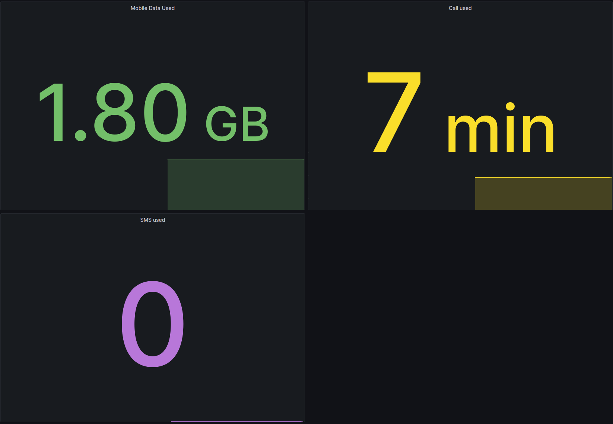

# umobile-exporter



## Build

```sh
cargo build --release
```

## Run

Set `CONF_USERNAME` and `CONF_PASSWORD` environment variables and run it.

You can grab a docker image from `ghcr.io/skystar-p/umobile-exporter`.
